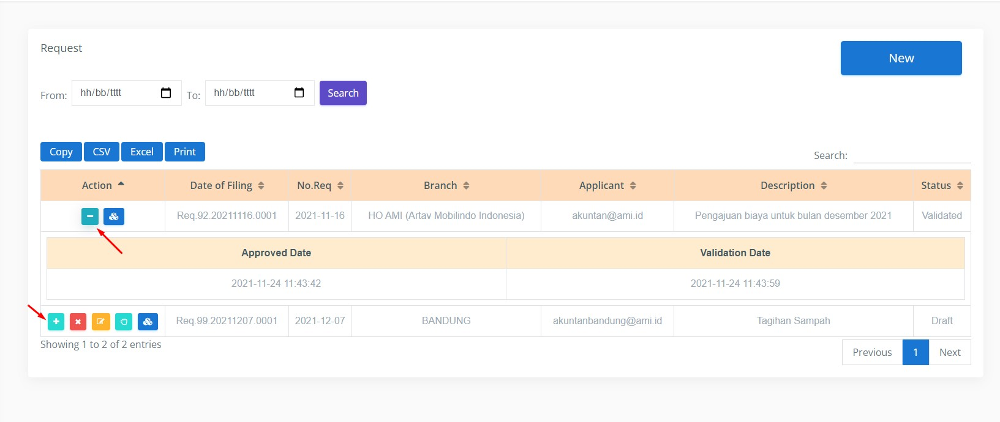

# Collapse Table Row

# CreateBy : ihsandulu

# 8 Des 2021

# JS + Jquery

Collapse Table Row

File digunakan untuk membuat tr pada table menjadi collapse.

Cara penggunaan:

1. Import file collapse.js seperti berikut .

2. Import font awesome (wajib).

3. Beri ID unik pada tr.

4. Beri action onClick pada button dengan format tampilrow(elemennya, id_unik_tr, colspan, array_untuk_judul_th, array_untuk_isi_td).

   4.a. elemennya diisi dengan this.

   4.b. id_unik_tr diisi dengan id unik pada elemen tr.

   4.c. colspan diisi dengan jumlah tc (kolom pada table).

   4.d. array_untuk_judul_th diisi dengan data title pada th. Contoh : ['Approved Date','Validation Date'].

   4.e. array_untuk_isi_td diisi dengan data-data pada td. Contoh : ['2021-12-01','2021-12-01'].

==========================================================================

Contoh :

    <tr id="d1">
        <td>
            <a href="#" onclick="tampilrow(this,'d1','7', ['Approved Date', 'Validation Date'], ['2021-12-01', '2021-12-01'])" class="btn btn-sm btn-success tampilrow">
                
            </a>
        </td>
    </tr>

==========================================================================

**_Semoga Bermanfaat. Aamiiin_**
